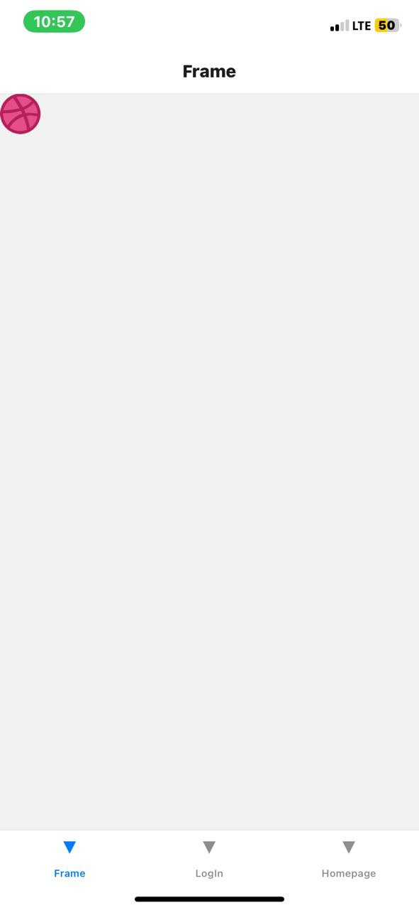
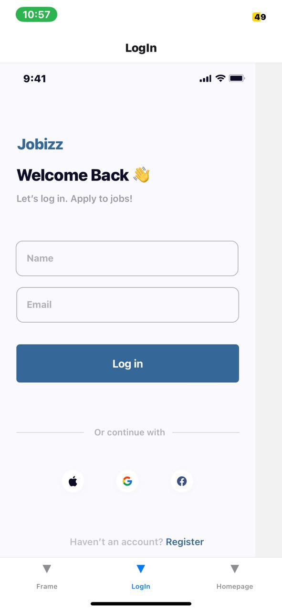

# rn-assignment4-11071863 
# rn-assignment4-11071863
# Welcome to MyApp, UI Mockup Recreation 4.0👋

## 11071863
## DCIT 202_Mobile App Development 
##Assignment 4

## Screenshots of Apps

## ✨Description of Each Component's Usage👩‍💻

1. NavigationContainer
NavigationContainer is the top-level component that sets up the navigation system for the app. It provides a navigation context to all screens and manages the navigation state. It's responsible for handling navigation events, such as screen transitions, and provides access to navigation-related functionality, such as navigation options and the navigation ref.

Usage: Myapp is wrapped with NavigationContainer to enable navigation.

2. Stack.Navigator
Stack.Navigator is a navigator that renders a stack of screens. It's used to define a stack of screens that can be navigated between. The stack navigator supports features such as screen transitions, header customization, and navigation options.

3. Stack.Screen
Stack.Screen is a single screen within a stack navigator. It defines a screen that can be navigated to. The Stack.Screen component accepts several props, such as name, component, options, and initialParams, which allow you to customize the behavior and appearance of the screen.

4. useNavigation
 useNavigation is a hook that provides access to the navigation object, allowing you to navigate programmatically. The navigation object provides methods for navigating to other screens, such as navigate, push, pop, and goBack.

Usage: The  useNavigation makes it possible to perform other navigation actions.

5. HeaderShownContext
 HeaderShownContext is a context that provides a way to show or hide the header (toolbar) on a screen. The header is a component that appears at the top of the screen and provides a title and navigation buttons.

Usage: It is used to control the visibility of the header on a screen.

## License 
MIT License
Copyright (c) 2024 rn-assignment4-11071863